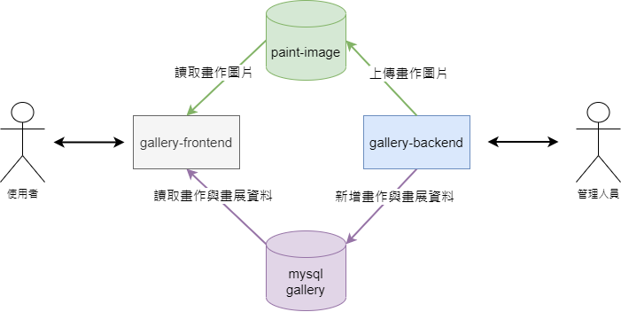
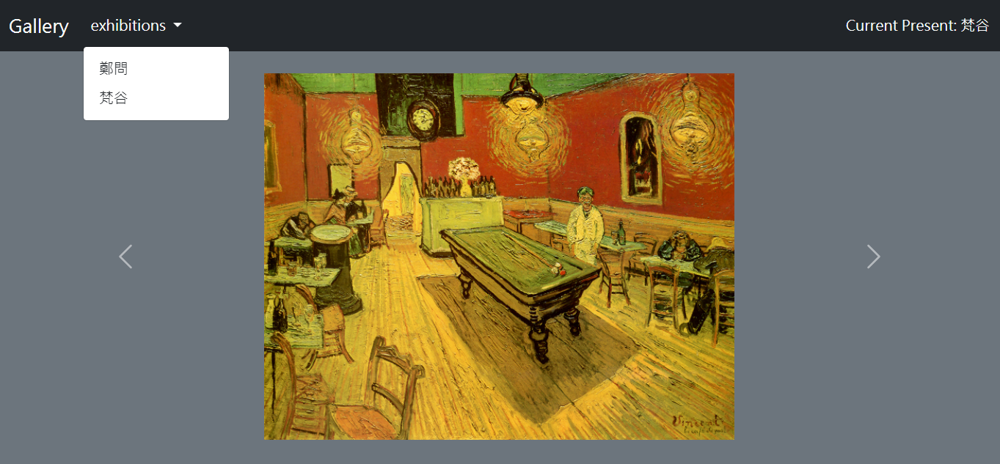
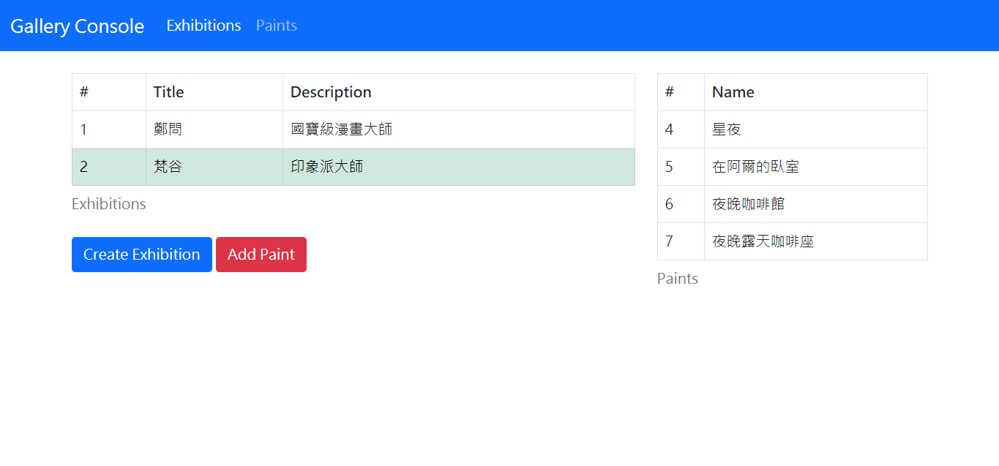
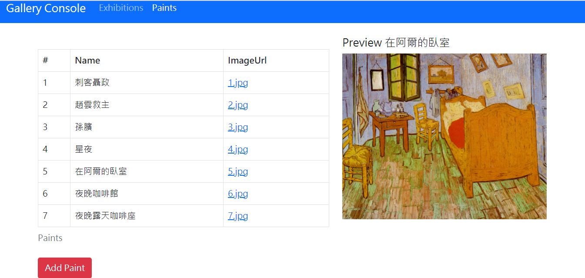
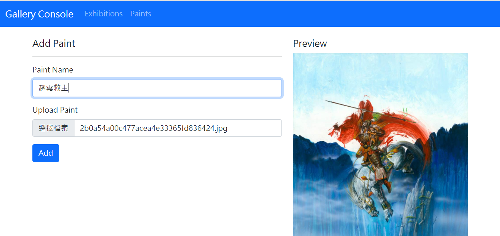

# Gallery

## 簡介

Golang寫的簡易網頁版畫展app，分為前台與後台:

* 前台功能主要是展示畫展，可以選擇要看哪一個畫展。

* 後台功能主要是新增畫展，上傳畫作圖片並將該畫作加到畫展裡面。

### 啟動

直接在本目錄下執行以下指令:
```
docker-compose up -d
```

由於mysql資料庫需要初始化，等到mysql容器的log出現此紀錄:
```
2021-05-02T08:50:37.308644Z 0 [System] [MY-010931] [Server] /usr/sbin/mysqld: ready for connections. Version: '8.0.21' socket: '/var/run/mysqld/mysqld.sock' port: 3306 MySQL Community Server - GPL.
```

代表初始化已完成，前後台程式才能正常連到mysql資料庫，要加快mysql資料庫初始化的流程的話，可以將mysql的初始化資料備份下來，這需要修改docker-compose檔案，關於備份資料庫資料這邊可以參考mysql官方docker文件:

[mysql: Caveats - Where to Store Data](https://hub.docker.com/_/mysql)

## 專案架構


* gallery-frontend: 前台，負責提供畫展與畫作資料，並顯示畫作圖片。
* gallery-backend: 後台，可以新增畫展或畫作，上傳畫作圖片。
* paint-image: 畫作圖片儲存的地方，目前是以docker volume掛上。
* mysql/gallery: 儲存畫展與畫作的資料庫，資料庫使用mysql。

## 功能展示

### 前端展示頁面


### 後端畫展管理頁面


### 後端畫作管理頁面


### 後端上傳畫作頁面
